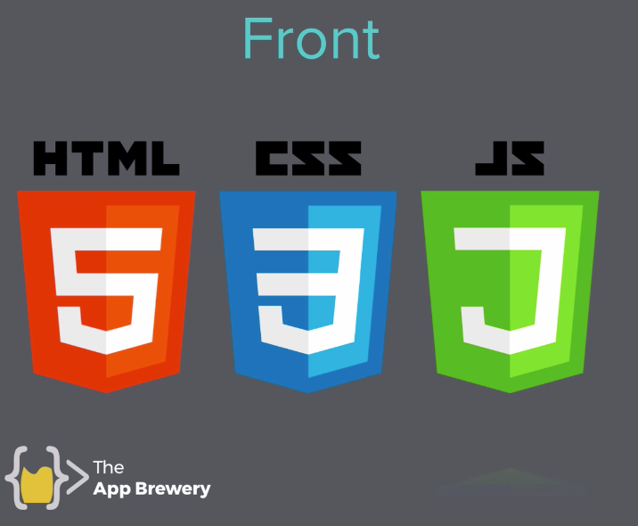

## Front-End Development

Front-End refers to browser, client slide technologies. Front-End Development focuses on user interaction on the client slide (browser) and allow us to design websites and make them interactive.

Front-End Technologies:

- HTML
- CSS
- Javascript
- jQuery
  - JavaScript Library
- Bootstrap
  - Framework

